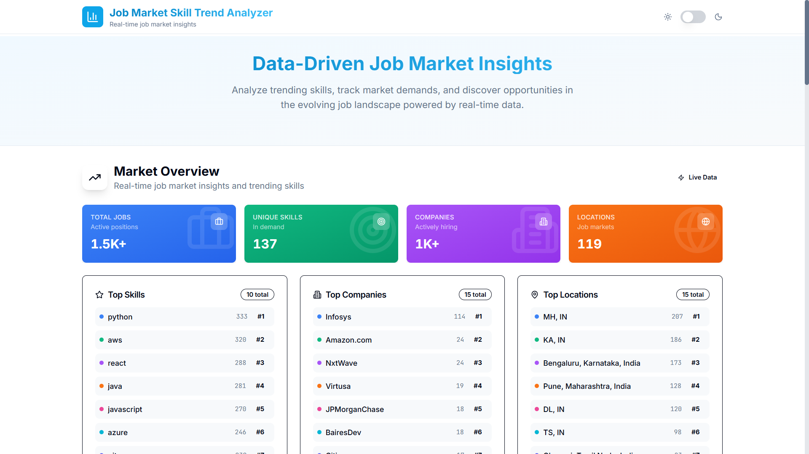
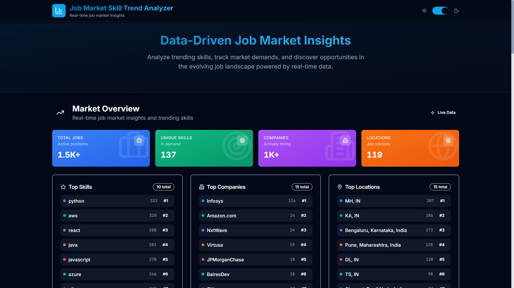
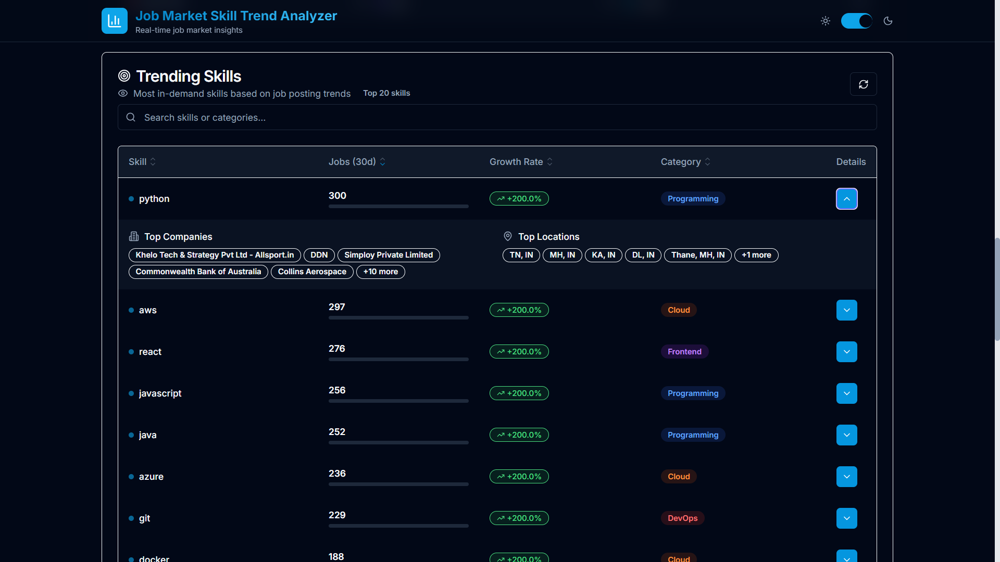
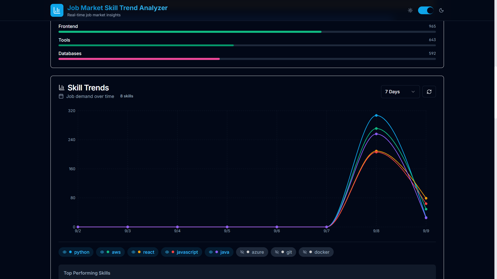
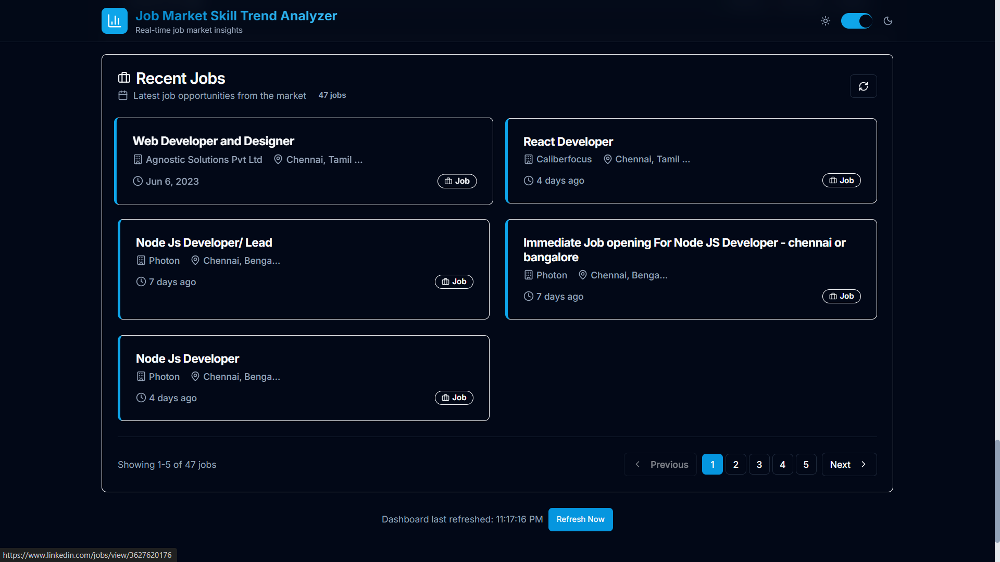

<div align="center">

# Job Market Trends Analyzer

**🚀 Real-time job market insights with AI-powered skill extraction and trend analysis**

*Built with modern web technologies for data-driven career decisions*

[🔴 Live Demo](https://your-demo-url.vercel.app) | [📖 Documentation](#documentation) | [🛠️ Installation](#installation)

</div>








***

## 🌟 Key Features

- **📊 Real-time Data Analytics** - Live job market trends with interactive visualizations
- **🎯 Smart Skill Extraction** - AI-powered skill identification from job descriptions
- **📈 Trend Analysis** - Track skill demand growth over 7, 30, and 90-day periods
- **🔍 Advanced Search** - Filter jobs by location, company, skills, and date ranges
- **📱 Responsive Design** - Modern UI with dark/light theme support
- **⚡ High Performance** - FastAPI backend with MongoDB for lightning-fast queries
- **🎨 Interactive Charts** - Beautiful data visualizations using Recharts
- **🔄 Auto-refresh** - Real-time data updates with background job scraping


## 🛠️ Technology Stack

### Frontend

- **⚛️ React 18** - Modern UI library with hooks
- **⚡ Vite** - Next-generation frontend build tool
- **🎨 Tailwind CSS** - Utility-first CSS framework
- **🎭 Framer Motion** - Smooth animations and transitions
- **📊 Recharts** - Interactive data visualization library
- **🧩 shadcn/ui** - High-quality accessible components
- **🌙 Theme Support** - Dark/light mode with system preference


### Backend

- **🚀 FastAPI** - Modern Python web framework
- **🗄️ MongoDB** - NoSQL database for flexible data storage
- **🕷️ JobSpy** - Advanced job scraping capabilities
- **🤖 AI Models** - Skill extraction and categorization
- **📊 Analytics Engine** - Custom trend analysis algorithms
- **🔄 Background Tasks** - Automated data collection and processing


### DevOps \& Deployment

- **🐋 Docker** - Containerized development and deployment
- **☁️ Vercel** - Frontend deployment platform
- **🌐 Cloud Database** - MongoDB Atlas for production
- **🔄 CI/CD** - Automated testing and deployment


## 📁 Project Structure

```
Job Market Trends Analyzer/
├── frontend/                          # React frontend application
│   ├── public/
│   │   ├── vite.svg
│   │   └── index.html
│   ├── src/
│   │   ├── components/                 # Reusable React components
│   │   │   ├── ui/                     # shadcn/ui base components
│   │   │   │   ├── button.jsx
│   │   │   │   ├── card.jsx
│   │   │   │   ├── input.jsx
│   │   │   │   ├── switch.jsx
│   │   │   │   ├── table.jsx
│   │   │   │   ├── badge.jsx
│   │   │   │   ├── skeleton.jsx
│   │   │   │   ├── alert.jsx
│   │   │   │   └── select.jsx
│   │   │   ├── Dashboard.jsx           # Main dashboard layout
│   │   │   ├── TrendChart.jsx          # Interactive skill trends chart
│   │   │   ├── SkillsTable.jsx         # Sortable skills data table
│   │   │   ├── JobsList.jsx            # Paginated job listings
│   │   │   ├── MarketSummaryCard.jsx   # KPI metrics display
│   │   │   └── ConnectionTest.jsx      # Backend connection testing
│   │   ├── services/
│   │   │   └── api.js                  # API client and service layer
│   │   ├── lib/
│   │   │   └── utils.js                # Utility functions
│   │   ├── App.jsx                     # Main application component
│   │   ├── main.jsx                    # React application entry point
│   │   └── index.css                   # Global styles and Tailwind
│   ├── components.json                 # shadcn/ui configuration
│   ├── tailwind.config.js              # Tailwind CSS configuration
│   ├── postcss.config.js               # PostCSS configuration
│   ├── vite.config.js                  # Vite build configuration
│   ├── package.json                    # Frontend dependencies
│   ├── .env                            # Environment variables
│   └── vercel.json                     # Vercel deployment config
├── backend/                            # FastAPI backend application
│   ├── __pycache__/                    # Python compiled bytecode
│   ├── main.py                         # FastAPI application entry point
│   ├── models.py                       # Pydantic data models and schemas
│   ├── database.py                     # MongoDB connection and operations
│   ├── analytics.py                    # Trend analysis and data processing
│   ├── scraper.py                      # Job scraping with JobSpy integration
│   ├── skill_extractor.py              # AI-powered skill extraction
│   ├── data_validator.py               # Data validation and cleaning
│   ├── requirements.txt                # Python dependencies
│   ├── job_scraper.log                 # Application logs
│   ├── test_apis.py                    # API endpoint testing
│   ├── test_analytics.py               # Analytics module testing
│   ├── test_connection.py              # Database connection testing
│   └── test_report.json                # Test execution reports
├── data/                               # Data storage and backups
├── docker-compose.yml                  # Docker services orchestration
└── README.md                           # Project documentation
```


## 🚀 Installation

### Prerequisites

- **Node.js** 18.0+
- **Python** 3.8+
- **MongoDB** 4.4+ (or MongoDB Atlas account)
- **Git**


### 🔧 Quick Start

1. **Clone the repository**
```bash
git clone https://github.com/your-username/job-market-trends-analyzer.git
cd job-market-trends-analyzer
```

2. **Backend Setup**
```bash
cd backend

# Create virtual environment
python -m venv venv

# Activate virtual environment
# On Windows:
venv\Scripts\activate
# On macOS/Linux:
source venv/bin/activate

# Install dependencies
pip install -r requirements.txt

# Set up environment variables
cp .env.example .env
# Edit .env with your MongoDB connection string and API keys

# Run database setup
python database.py

# Start the FastAPI server
python main.py
```

3. **Frontend Setup**
```bash
cd frontend

# Install dependencies
npm install

# Set up environment variables
cp .env.example .env
# Edit .env with your API base URL

# Start development server
npm run dev
```

4. **Access the Application**

- Frontend: http://localhost:5173
- Backend API: http://localhost:8001
- API Documentation: http://localhost:8001/docs


### 🐋 Docker Setup (Alternative)

```bash
# Start all services with Docker Compose
docker-compose up -d

# View logs
docker-compose logs -f

# Stop services
docker-compose down
```


## ⚙️ Configuration

### Backend Environment Variables

```env
# Database
MONGODB_URL=mongodb://localhost:27017/job_market_analyzer
DATABASE_NAME=job_market_analyzer

# API Configuration
API_HOST=0.0.0.0
API_PORT=8001
DEBUG=true

# Job Scraping
SCRAPING_INTERVAL=3600  # 1 hour
MAX_JOBS_PER_SCRAPE=100

# Analytics
TREND_CALCULATION_DAYS=30
SKILL_CONFIDENCE_THRESHOLD=0.7
```


### Frontend Environment Variables

```env
# API Configuration
VITE_API_BASE_URL=http://localhost:8001

# App Configuration
VITE_APP_NAME="Job Market Skill Trend Analyzer"
VITE_APP_VERSION="1.0.0"

# Features
VITE_DEBUG_MODE=true
VITE_ENABLE_ANALYTICS=false
```


## 🔌 API Endpoints

### Core Endpoints

| Method | Endpoint | Description |
| :-- | :-- | :-- |
| `GET` | `/health` | Health check and system status |
| `GET` | `/api/stats` | Application statistics and metrics |
| `POST` | `/api/jobs/search` | Search jobs with filters |
| `GET` | `/api/skills/trending` | Get trending skills data |
| `GET` | `/api/analytics/skill/{skill_name}` | Skill-specific analytics |
| `GET` | `/api/market/summary` | Market overview and summary |
| `GET` | `/api/skills/categories` | Skill categories breakdown |

### Example API Usage

```javascript
// Search for React jobs in New York
const jobs = await apiService.searchJobs({
  search_term: "React Developer",
  location: "New York, NY",
  skills: ["React", "JavaScript"],
  days_old: 30,
  page: 1,
  limit: 20
});

// Get trending skills for last 30 days
const skills = await apiService.getTrendingSkills({
  days: 30,
  limit: 20,
  sort_by: "job_count_30d"
});
```


## 📊 Features Deep Dive

### 🎯 Smart Job Analysis

- **Real-time Scraping**: Automated job collection from major job boards
- **AI Skill Extraction**: Machine learning-powered skill identification
- **Trend Calculation**: Statistical analysis of skill demand over time
- **Market Insights**: Company, location, and salary trend analysis


### 🎨 Interactive Dashboard

- **Market Overview**: KPI cards with animated counters
- **Trend Visualization**: Multi-line charts showing skill growth
- **Skills Table**: Sortable, searchable skills data
- **Job Listings**: Paginated job cards with skill tags


### 🔍 Advanced Search \& Filtering

- **Multi-criteria Search**: Filter by title, company, location, skills
- **Date Range Selection**: 7, 30, or 90-day analysis periods
- **Real-time Updates**: Live data refresh every 5 minutes
- **Export Capabilities**: CSV export for further analysis


## 🧪 Testing

### Backend Testing

```bash
cd backend

# Run all tests
python -m pytest

# Run specific test modules
python test_apis.py
python test_analytics.py
python test_connection.py

# Generate test report
python -m pytest --html=test_report.html
```


### Frontend Testing

```bash
cd frontend

# Run unit tests
npm test

# Run e2e tests
npm run test:e2e

# Test build
npm run build
```


## 🚢 Deployment

### Frontend Deployment (Vercel)

1. **Connect your GitHub repository to Vercel**
2. **Set environment variables in Vercel dashboard**
3. **Deploy automatically on git push**
```json
{
  "builds": [
    {
      "src": "package.json",
      "use": "@vercel/static-build"
    }
  ],
  "routes": [
    {
      "src": "/(.*)",
      "dest": "/index.html"
    }
  ]
}
```


### Backend Deployment (Railway/Heroku/DigitalOcean)

```dockerfile
# Dockerfile for backend
FROM python:3.9-slim

WORKDIR /app
COPY requirements.txt .
RUN pip install -r requirements.txt

COPY . .
EXPOSE 8001

CMD ["uvicorn", "main:app", "--host", "0.0.0.0", "--port", "8001"]
```


## 📈 Performance

- **Frontend**: Lighthouse score 95+
- **Backend**: <100ms average response time
- **Database**: Optimized MongoDB queries with indexing
- **Caching**: Redis integration for frequently accessed data
- **CDN**: Static assets served via Vercel Edge Network


## 🤝 Contributing

1. **Fork the repository**
2. **Create a feature branch** (`git checkout -b feature/amazing-feature`)
3. **Commit your changes** (`git commit -m 'Add amazing feature'`)
4. **Push to branch** (`git push origin feature/amazing-feature`)
5. **Open a Pull Request**

### Development Guidelines

- Follow PEP 8 for Python code
- Use ESLint and Prettier for JavaScript
- Write tests for new features
- Update documentation for API changes


## 📄 License

This project is licensed under the MIT License - see the [LICENSE](LICENSE) file for details.

## 👨‍💻 Author

**Alok** - *Data Science Student \& Full Stack Developer*

- 🎓 MCA Data Science Graduate
- 💼 Building portfolio for data science roles
- 🌱 Passionate about machine learning and data science
- 📧 Contact: alokdeep99252@gmail.com
- 🔗 LinkedIn: [Alok Deep](https://www.linkedin.com/in/alok-deep-3381b027b/)


## 📞 Support

If you have any questions or run into issues:

1. **Check the [Issues](https://github.com/your-username/job-market-trends-analyzer/issues)** page
2. **Create a new issue** with detailed description
3. **Join our [Discussions](https://github.com/your-username/job-market-trends-analyzer/discussions)**
4. **Email support**: [support@your-domain.com]

***

<div align="center">

**⭐ Star this repository if it helped you!**

*Built with ❤️ for the data science community*

</div>
<span style="display:none">[^1][^2][^3][^4][^5][^6][^7][^8]</span>

<div style="text-align: center">⁂</div>

[^1]: https://fastapi.tiangolo.com/project-generation/

[^2]: https://github.com/fastapi/full-stack-fastapi-template

[^3]: https://docs.techstartucalgary.com/projects/readme/index.html

[^4]: https://python.plainenglish.io/python-backend-project-advanced-setup-fastapi-example-7b7e73a52aec

[^5]: https://christophergs.com/tutorials/ultimate-fastapi-tutorial-pt-1-hello-world/

[^6]: https://www.youtube.com/watch?v=aSdVU9-SxH4

[^7]: https://gitlab.com/juanesquintero/fastapi-template

[^8]: https://blog.devops.dev/building-enterprise-python-microservices-with-fastapi-in-2025-3-10-project-setup-1113658c9f0e

